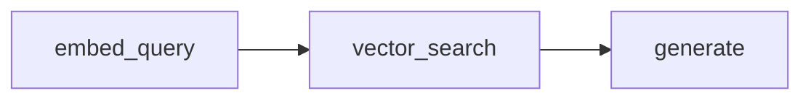
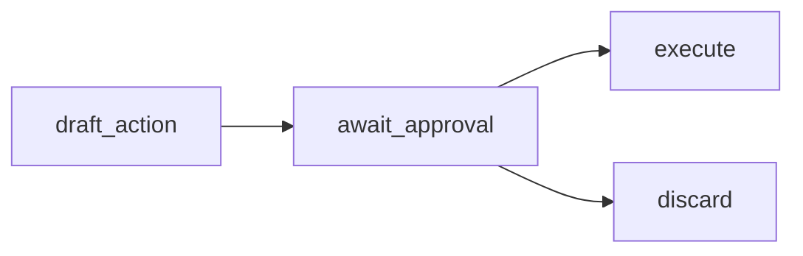
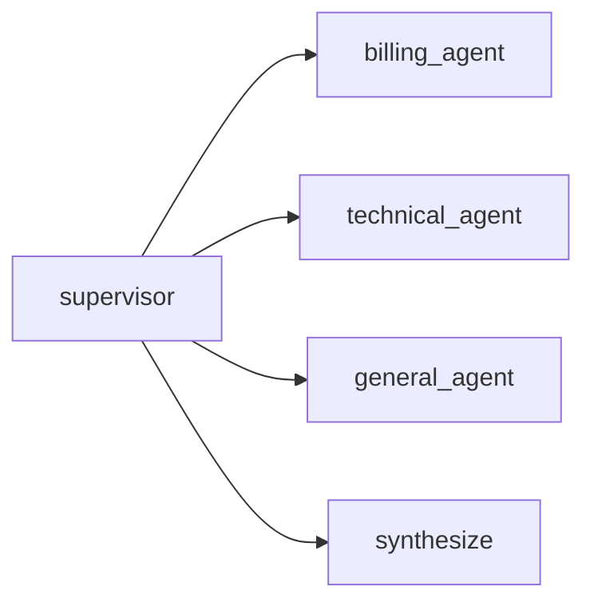
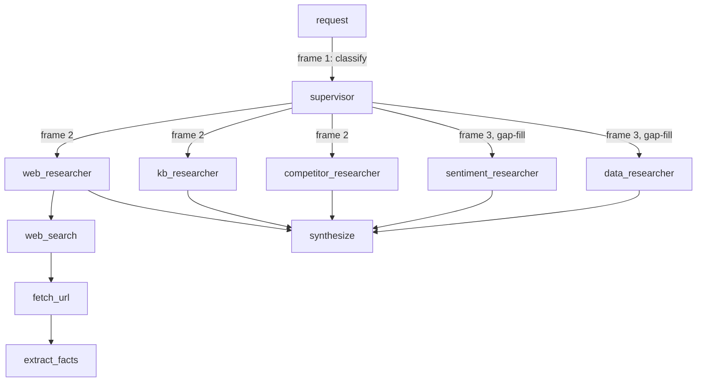
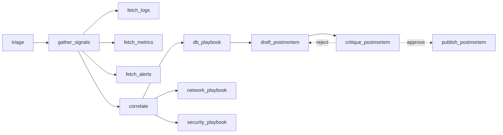

# Agent architecture shapes

Five example workflows, each built the way a developer would actually
build that agent (a tool-calling loop, a LangGraph state machine, or a
plain linear pipeline when that's genuinely all the shape needs) — the
call-graph topology below is what falls out of that, not something
hand-shaped in a plain function to hit a target diagram. See
`praximetry-cloud`'s `dashboard/server.py` (`find_back_edges`,
`assign_layers`, `/api/network`) for how `layer`/`back_arc`/`concurrent`
are computed from the resulting `Call.parent_call_id` chain.

**Node visibility rule:** a stage only produces a graph node if it calls
an LLM (via `chat_model(...).invoke(...)`) or `record_call` itself.
Pure-Python or delegate-only `@stage` functions record no `Call` row and
never appear — several workflows use zero-cost `record_call(cost_usd=0)`
specifically to keep a non-LLM step visible.

**Composite stage paths:** a nested `@stage` call inside an active
`@stage` records as `"outer>inner"` (PRA-81); the dashboard's
`_innermost_stage` collapses this to `"inner"` for node identity. An
orchestrator that only delegates (never calls the LLM itself) is
therefore invisible as a node even though it's `@stage`-decorated.

**Concurrent dispatch and context:** contextvars don't survive a new
thread or LangGraph's per-node executor, so any workflow that fans out
concurrently (a `ThreadPoolExecutor` dispatch, a LangGraph node) threads
`runtime.capture_context()`/`restore_context()` explicitly through graph
state instead — see `runtime.py`. This is what makes concurrently
dispatched agents parent correctly to whichever call dispatched them,
with no gather/join caveat.

## Retrieval-augmented generation (RAG)

`rag_retrieval`. `embed_query`/`vector_search` are non-LLM (BM25) but
record explicitly, so both stay visible. Verified: 3 `Call` rows, linear
chain.

## Human-in-the-loop approval

`human_approval`. `await_approval` records explicitly; two outgoing
edges, both `concurrent: 0` (alternatives).

## Supervisor / multi-agent delegation

`supervisor_delegation`. Built on LangGraph, same as `research_supervisor`
scaled down: a single classify-then-dispatch round, no per-agent tool use.
`supervisor` classifies via a JSON-instructed call, validated into
`DomainClassification` after stripping any leaked reasoning block (see
`_real.clean_content`); 1-3 of 3 agents dispatched concurrently per run
(varies, unlike fixed fan-out) via a `ThreadPoolExecutor` in `dispatch_node`.
`dispatch_node` doesn't advance the carried `_px_ctx`, so both the agents
and `synthesize` genuinely parent to `supervisor`'s own call — a real
sibling group, not a gather/join artifact.

**Playback pulse-order gap ([PRA-90](https://linear.app/praximetry/issue/PRA-90/playback-frame-grouping-mislabels-sequential-single-leg-joins-as)):**
frame grouping already matches the target (agents + `synthesize` share
one frame), but all members currently pulse simultaneously instead of
`synthesize` pulsing after the agents it depends on — because its
`parent_call_id` is `supervisor`, same as the agents, with nothing
marking it downstream. Target: pulse/count each frame in `ts` order.
Side-panel step list is already correct (sorts by `ts` directly).

## Research supervisor: two-round fan-out + nested tool use

`research_supervisor` — same shape as `supervisor_delegation` scaled up:
two dispatch rounds instead of one, and each agent is its own bounded
tool-use loop (3 tools each) rather than a flat call. Dispatched agents
genuinely parent to the `supervisor` call that dispatched them, and each
round's `supervisor` call parents to the previous one.

Round 1 fans out 2-3 of `web_researcher`/`kb_researcher`/
`competitor_researcher`; round 2 (0-2 of `sentiment_researcher`/
`data_researcher`) fills gaps after seeing round 1's findings; then
`synthesize`. Each agent's 3 tools chain sequentially underneath it
(shown once, for `web_researcher`, representative of all five) with
composite stage paths (`"{agent}>{tool}"`) collapsing to the tool node.
Verified end-to-end against real recorded traffic (5-request batch +
a synthetic concurrent-dispatch test): single coherent run per request,
zero orphaned parents, correct nesting under true same-turn fan-out.

## Branch + fan-out + retry (composite)

`incident_response` — the richest shape: a branch (`correlate` to one of
three playbooks), a fan-out/join (`gather_signals`/`fetch_*`/`correlate`),
and a retry loop (`draft_postmortem`/`critique_postmortem`). Built on
LangGraph: `triage`/`correlate`/`draft_postmortem`/`critique_postmortem`/
`publish_postmortem` are each their own node, with `add_conditional_edges`
implementing the retry loop (bounded at `MAX_REVISIONS`). `gather_signals`
fetches the `fetch_logs`/`fetch_metrics` baseline directly (deterministic,
not left to model compliance) and lets a bound-tools LLM call decide
whether `fetch_alerts` is also warranted, dispatching whichever tools it
picked concurrently via a `ThreadPoolExecutor`; each playbook is its own
bounded tool-calling agent (`fail_over_primary`/`drain_connection_pool` for
`db_playbook`, `reroute_traffic`/`flush_dns_cache` for `network_playbook`,
`rotate_credentials`/`revoke_sessions` for `security_playbook`) rather than
a flat call. `fetch_*` and playbook-tool stages record as
`"gather_signals>fetch_*"` / `"{playbook}>{tool}"`, collapsing to the tool
node. `gather_signals` and each playbook are themselves real nodes (call
the LLM directly before/alongside dispatching tools), and correctly parent
their dispatched tool calls to themselves — no gather/join caveat.
Covered by `praximetry-cloud`'s `tests/test_workflows_smoke.py` and
`tests/test_network_graph_shapes.py`.
