# Agent architecture shapes

Every example workflow in this directory, grouped by the distinct
call-graph *topology* it produces — not by domain. Each entry names the
workflow(s) demonstrating that shape and the `/api/network` structure a
correct render must show (see `praximetry-cloud`'s
`src/praximetry_cloud/dashboard/server.py`'s
`find_back_edges`/`assign_layers`/the `/api/network` handler for how these
structural properties — `layer`, `back_arc`, `concurrent`, `passes` — are
computed; `tests/test_dashboard.py` in that repo only exercises them).

**A stage only produces a graph node if it calls `real_chat` (or
`runtime.record_call` directly) itself.** A `@praximetry.stage`-decorated
function that just calls plain Python, or only delegates to other
`@stage` functions, never emits a `Call` row for its own name — so it
never appears as a node or an edge endpoint in `/api/network`, no matter
how the code is organized. Several workflows below use explicit
zero-cost `runtime.record_call()` calls precisely to keep a genuinely
non-LLM step visible in the graph (`retry_validation_loop.validate`,
`tool_use_loop.call_tool`, `human_approval.await_approval`,
`rag_retrieval.embed_query`/`vector_search`); others don't, and those
steps are simply invisible to the graph. The counts and shapes below are
verified against each workflow's actual `real_chat`/`record_call` call
sites, not just its `@stage` decorator count.

Relatedly, when a `@stage` function is still active while it calls
another `@stage` function that itself calls `real_chat`, praximetry
records the inner call's `stage` as the composite path
`"outer>inner"` (PRA-81) rather than just `"inner"`. The dashboard's
`_innermost_stage` (`src/praximetry_cloud/dashboard/server.py`) collapses
that back to `"inner"` for node identity, so this is invisible in the
rendered graph — but it means an *orchestrating* stage that never calls
`real_chat` itself (only its children do) also never appears as its own
node, even though it's a `@stage` function. This affects
`gaia_multihop.answer`, `tau_retail_agent.handle_request`, and
`swe_patch_agent.resolve` below — the brief's original draft of this
catalog assumed every `@stage` function is a node, which is wrong for
these three.

**A merge call made after `asyncio.gather`, in the orchestrator's own
frame, is never parented to one of the fanned-out children — it's
parented to whatever stage last ran in that frame before the gather.**
`asyncio.Task` copies `contextvars.Context` at task-creation time, so
mutations inside a gather-spawned Task (including `record_call`'s
parent-tracking) never propagate back out to the caller. This means a
"fan-out then join" shape never actually renders a `child -> merge` edge
in `/api/network`, no matter how the source reads — the merge sits at the
*same* layer as the fan-out's own parent, not one layer above the
children. It affects `research_summarizer`, `supervisor_delegation`, and
`incident_response`'s `gather_signals`/`correlate` pair below; each
section calls this out explicitly. Compounding this, the dashboard marks
any edge whose parent has >=2 children sharing that `parent_call_id` as
`concurrent` (`server.py`'s sibling-count check) — since the merge call
*is* one of those siblings (same parent, same call frame timing), it gets
flagged `concurrent` too, which reads as "the merge ran in parallel with
the workers" even though it strictly followed them. Known, currently
unfixed cosmetic limitation of the graph render, not a bug in the
workflows.

## Sequential pipeline

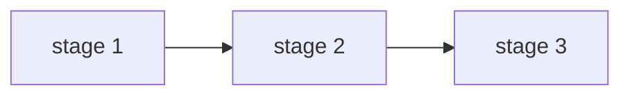

Workflows: `invoice_extraction` (1 stage: `extract_invoice`).

Expected `/api/network`: each stage a distinct node, exactly one outgoing
edge per stage, `back_arc: false` and `concurrent: 0` everywhere, layers
strictly increasing.

## Sequential pipeline, two visible stages (one step is invisible)

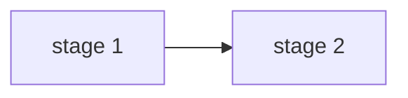

Workflows: `support_triage` (`classify -> respond`), `gaia_multihop`
(`decompose -> final_answer`), `tau_retail_agent` (`plan_action ->
write_reply`), `swe_patch_agent` (`localize -> propose_patch`).

Each of these workflows *reads* as a 3-stage pipeline in its source (and
`support_triage`/`tau_retail_agent`/`swe_patch_agent` each have a third
`@stage`-decorated function in the middle or at the end), but the
middle/last step never calls `real_chat` or `record_call`, so it emits no
`Call` row and never appears in `/api/network`:

- `support_triage.retrieve(category)` — plain dict lookup, no LLM/record call.
- `gaia_multihop.lookup(hops)` — plain retrieval-index lookup.
- `tau_retail_agent.execute(action)` — mutates the in-memory order DB directly.
- `swe_patch_agent.run_tests(path, patch)` — actually execs and runs the
  repo's tests, but never records the result as a call.

`gaia_multihop.answer`, `tau_retail_agent.handle_request`, and
`swe_patch_agent.resolve` are themselves `@stage`-decorated wrapper
functions that only delegate to their child stages — they never call
`real_chat` directly either, so they *also* never appear as nodes. Their
children's calls get recorded with composite stage paths
(`"answer>decompose"`, `"answer>final_answer"`, etc.), which
`_innermost_stage` collapses to the plain child name for the graph.

Verified empirically by running each workflow's entry point once and
inspecting `get_store().calls()`: exactly two `Call` rows are produced per
invocation, one with `parent_call_id: null` (the first stage) and one
whose `parent_call_id` points at it (the second) — despite three `@stage`
functions existing in the source for each of these workflows.

Expected `/api/network`: two nodes, one edge, `back_arc: false`,
`concurrent: 0`, layers strictly increasing. No node for `retrieve`,
`lookup`, `execute`, `run_tests`, `answer`, `handle_request`, or
`resolve`.

## Sequential pipeline with fail-fast early exit — not observable in the graph

`swe_patch_agent.resolve` can return `"FAILED"` early (if `localize`
picks a file outside the known repo, or if `run_tests` comes back
`"FAIL"`) instead of reaching `"RESOLVED"`. This looked, from the source,
like it should produce a graph shape distinct from the plain sequential
pipeline above (a shorter chain on failure). It doesn't: `run_tests` is
exactly the non-LLM stage described above that never records a `Call`,
so pass/fail is invisible to `/api/network` either way — every run of
`resolve` renders as the same two-node `localize -> propose_patch` chain
regardless of whether the patch actually passed. There is no dedicated
`/api/network` shape for "fail-fast early exit"; call-graph shape alone
cannot distinguish a resolved run from a failed one here.

## Standalone branching router

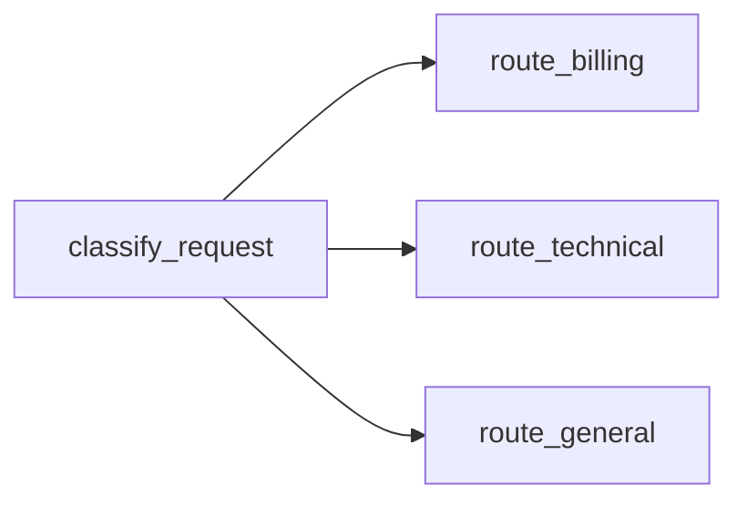

Workflow: `branching_router`. `classify_request` genuinely has three
possible successors across the corpus.

Expected `/api/network`: `classify_request` has three outgoing edges, each
`concurrent: 0` (alternatives, not concurrent siblings — each run only
takes one), the three route stages share a layer.

## Concurrent fan-out + join (map-reduce)

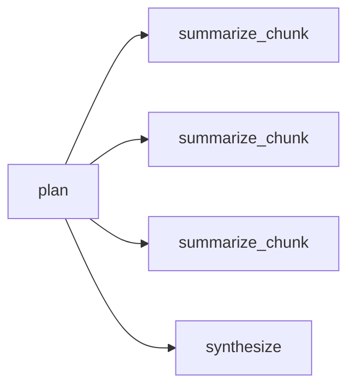

Workflow: `research_summarizer`. `synthesize` is called from `plan`'s
frame after the `asyncio.gather` over `summarize_chunk`, so — per the
gather/join note above — its parent is `plan`, not any `summarize_chunk`
instance; there is no `summarize_chunk -> synthesize` edge.

Expected `/api/network`: `plan -> summarize_chunk` edge has `concurrent`
equal to the number of chunks (siblings sharing one parent call); `plan
-> synthesize` is a separate edge at the *same* layer as the
`summarize_chunk` instances (both are `plan`'s direct children), also
flagged `concurrent` since it shares `plan` as a parent with the other
edges — not a real concurrency signal here, see the note above.

## Standalone retry/validation loop

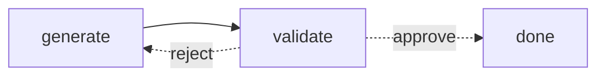

Workflow: `retry_validation_loop`. `validate` is non-LLM but explicitly
calls `runtime.record_call(cost_usd=0)` so it still shows up as a real
node in the graph, rather than disappearing the way `support_triage`'s
`retrieve` does.

Expected `/api/network`: exactly one of the `generate<->validate` edge pair
has `back_arc: true`; `generate`'s layer stays below every `validate` that
approves it.

## Supervisor / multi-agent delegation

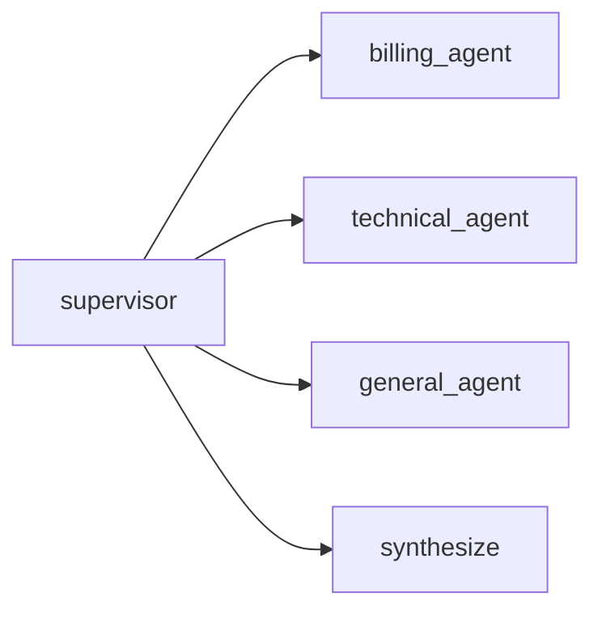

The graph shape above only shows *which* nodes connect, not the subtask
routing or execution order. Both are visible in the layered graph below —
still a graph view (not a trace/sequence view), since that's what
`/api/network` actually renders:

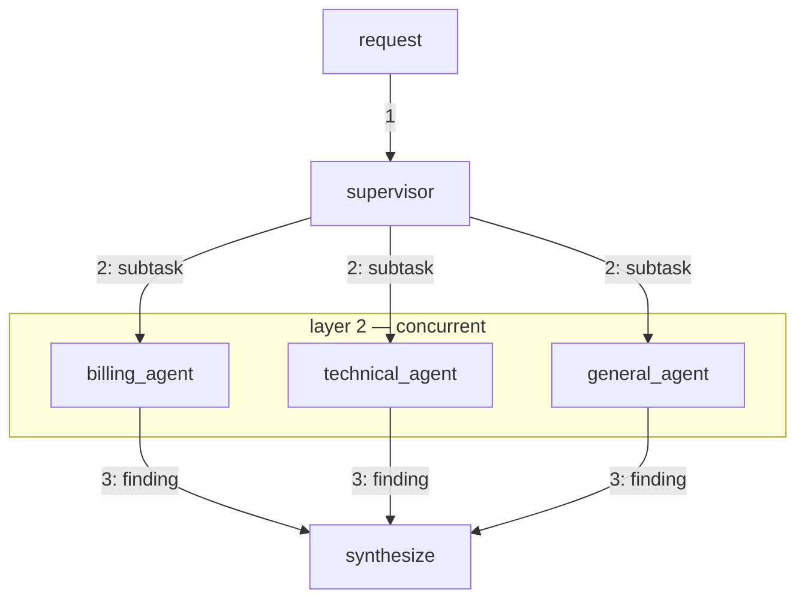

Edge labels are step numbers (1 = supervisor classifies, 2 = concurrent
subtask delegation, 3 = findings merge), and the `subgraph` groups the
agents that actually run concurrently — same layering `assign_layers`
computes for `/api/network`. Only the agents whose domain matched appear
(1-3 of the 3, not always all 3).

**This diagram is the intended logical flow, not the literal render:**
per the gather/join note above, `/api/network` never actually draws a
`*_agent -> synthesize` edge (the merge call is parented to `supervisor`,
not to any one agent) — the `B/C/D -> E` edges above exist here to show
where the findings logically go, not what the dashboard draws.

Workflow: `supervisor_delegation`. Distinct from fan-out+join because the
*set* of children invoked varies per run (1-3 of the 3 agents), not fixed.
`handle()` (the top-level orchestrator) is a plain function, not a
`@stage` — so unlike `tau_retail_agent`/`swe_patch_agent`/
`gaia_multihop`, `supervisor`/`*_agent`/`synthesize` calls are not nested
inside another active stage and their `Call.stage` values are the plain
names directly, with no composite path to collapse. `synthesize` is
called from `handle()`'s frame after the `asyncio.gather` over the
selected agents — per the gather/join note above, that makes its parent
`supervisor` (the last stage `handle()` itself ran), never one of the
agents; there is no `*_agent -> synthesize` edge.

Expected `/api/network`: `supervisor` has up to four outgoing edges (the
1-3 agents that ran, plus `synthesize`), all sharing `supervisor`'s layer
and all flagged `concurrent` together (see the sibling-count caveat
above) whenever more than one domain matched.

## Retrieval-augmented generation (RAG)

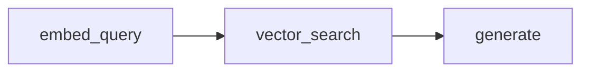

Workflow: `rag_retrieval`. `embed_query`/`vector_search` are non-LLM
stages (bag-of-words cosine similarity, no vector-DB dependency) that —
like `retry_validation_loop.validate` and unlike `support_triage.retrieve`
— explicitly call `runtime.record_call(cost_usd=0)`, so both remain
visible as real nodes.

Expected `/api/network`: three-node linear chain, same shape as "sequential
pipeline" above — the distinguishing fact is in the stage names/semantics,
not the topology. Verified by running `rag_retrieval.handle(...)` once:
three `Call` rows, `embed_query` (`parent_call_id: null`) ->
`vector_search` -> `generate`.

## Multi-turn iterative tool use

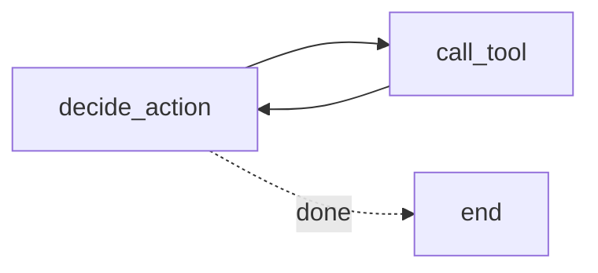

Workflow: `tool_use_loop`. `call_tool` is non-LLM but, like
`retry_validation_loop.validate`, explicitly calls
`runtime.record_call(cost_usd=0)` so it stays a visible node.

Expected `/api/network`: `decide_action -> call_tool -> decide_action` is a
genuine cycle; one of the two `decide_action<->call_tool` edges is
`back_arc: true`, same pattern as the standalone retry loop but named
differently to keep the two shapes distinguishable in the catalog.

## Human-in-the-loop approval

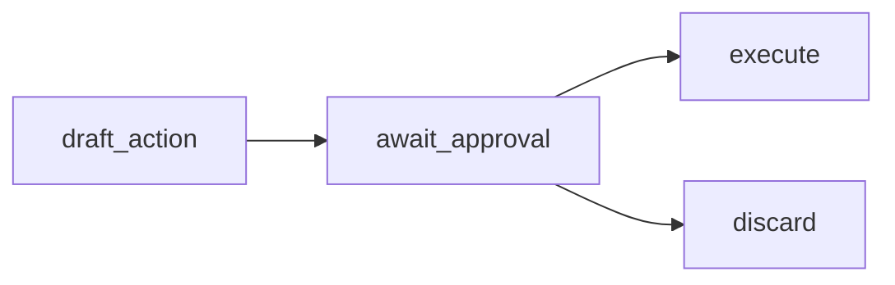

Workflow: `human_approval`. `await_approval` is non-LLM but explicitly
calls `runtime.record_call(cost_usd=0)`, so it appears as a real node
with two outgoing edges rather than disappearing.

Expected `/api/network`: `await_approval` has two outgoing edges
(`execute`, `discard`), both `concurrent: 0` (alternatives, not siblings).

## Branch + fan-out + retry (composite)

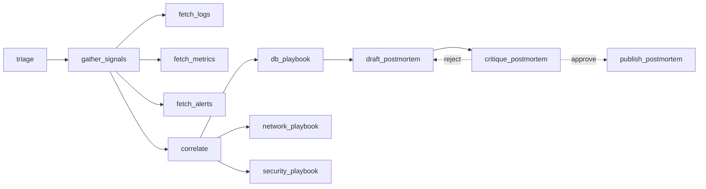

Workflow: `incident_response`. The richest shape — combines a branch
(`correlate` to one of three playbooks), a fan-out/join
(`gather_signals`/`fetch_*`/`correlate`), and a retry loop
(`draft_postmortem`/`critique_postmortem`) in one workflow. `fetch_logs`,
`fetch_metrics`, `fetch_alerts` run while `gather_signals` is still
active, so their `Call.stage` is recorded as `"gather_signals>fetch_logs"`
etc.; `_innermost_stage` collapses that to `fetch_logs` for the node.
`gather_signals` itself is also a real node because it calls `real_chat`
directly (a planning call) *before* fanning out — unlike the wrapper
stages in `gaia_multihop`/`tau_retail_agent`/`swe_patch_agent`, which
never call `real_chat` in their own frame. `correlate` is called from
`handle()`'s frame *after* `await gather_signals(...)` returns, so —
per the gather/join note above — its parent is `gather_signals` (the
call that ran just before the gather, inside `gather_signals`'s own
body), not any of the `fetch_*` siblings; there is no `fetch_* ->
correlate` edge, and `gather_signals -> correlate` shares the same
sibling group as `gather_signals -> fetch_*`, so it's also flagged
`concurrent` (see the sibling-count caveat above). Already covered by
`tests/test_workflows_smoke.py`'s `test_incident_*` tests and
`tests/test_benchmark_workflows.py`'s `test_incident_fanout_shares_one_parent_call`
(both in `praximetry-cloud`).

## Trace/graph passthrough (no `praximetry.stage` calls)

Workflow: `otel_graph_agent`. Emits raw OpenTelemetry GenAI spans;
`praximetry.instrument_otel()` maps span name -> stage after the fact. It
never calls a chat function at all — the "model calls" are hardcoded
token/cost attributes on synthetic spans, not real completions.
