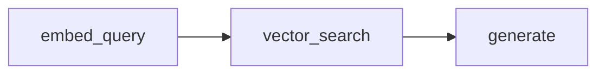
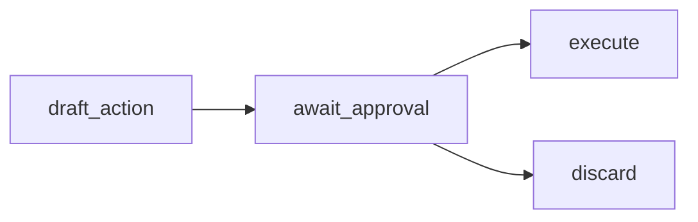
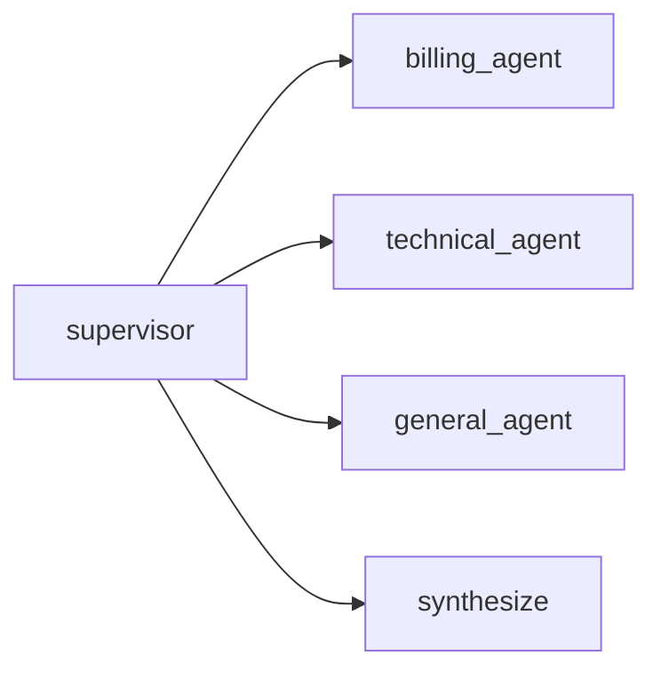
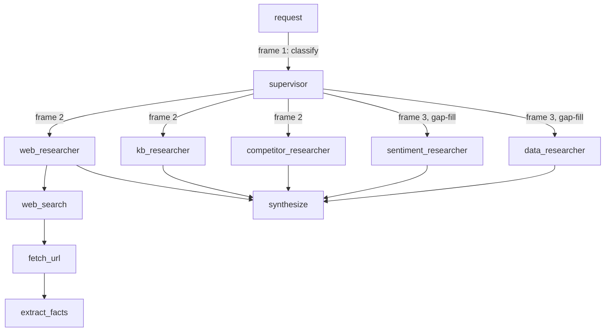
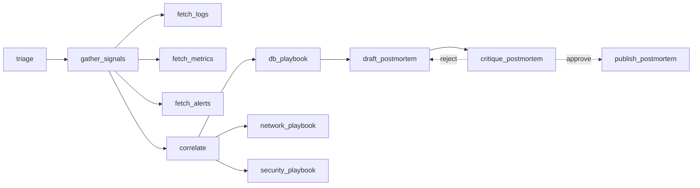

# Agent architecture shapes

Five example workflows, each a distinct call-graph *topology*, not domain.
See `praximetry-cloud`'s `dashboard/server.py` (`find_back_edges`,
`assign_layers`, `/api/network`) for how `layer`/`back_arc`/`concurrent`
are computed.

**Node visibility rule:** a stage only produces a graph node if it calls
an LLM (via `chat_model(...).invoke(...)`) or `record_call` itself.
Pure-Python or delegate-only `@stage` functions record no `Call` row and
never appear — several workflows use zero-cost `record_call(cost_usd=0)`
specifically to keep a non-LLM step visible.

**Composite stage paths:** a nested `@stage` call inside an active
`@stage` records as `"outer>inner"` (PRA-81); the dashboard's
`_innermost_stage` collapses this to `"inner"` for node identity. An
orchestrator that only delegates (never calls the LLM itself) is
therefore invisible as a node even though it's `@stage`-decorated.

**Gather/join parenting (`asyncio.gather` workflows only):** a merge call
made in the orchestrator's frame after `gather` parents to whatever stage
ran *before* the gather, not to any fanned-out child — `asyncio.Task`
copies context at creation time but never propagates mutations back out.
So fan-out+join never renders a `child -> merge` edge; the merge sits at
the fan-out's own layer and gets flagged `concurrent` alongside the real
siblings (cosmetic, not a bug). Affects `supervisor_delegation` and
`incident_response`. `research_supervisor` (LangGraph) avoids this
entirely — see its section.

## Retrieval-augmented generation (RAG)

`rag_retrieval`. `embed_query`/`vector_search` are non-LLM (BM25) but
record explicitly, so both stay visible. Verified: 3 `Call` rows, linear
chain.

## Human-in-the-loop approval

`human_approval`. `await_approval` records explicitly; two outgoing
edges, both `concurrent: 0` (alternatives).

## Supervisor / multi-agent delegation

`supervisor_delegation`. `supervisor` classifies via a structured-output
call (`with_structured_output(DomainClassification)`); 1-3 of 3 agents
invoked per run (varies, unlike fixed fan-out). `handle()` is a plain
function, so agent/synthesize `Call.stage` values are unqualified. Per
the gather/join note, `synthesize` parents to `supervisor`, sharing its
layer and `concurrent` flag with whichever agents ran.

**Playback pulse-order gap ([PRA-90](https://linear.app/praximetry/issue/PRA-90/playback-frame-grouping-mislabels-sequential-single-leg-joins-as)):**
frame grouping already matches the target (agents + `synthesize` share
one frame), but all members currently pulse simultaneously instead of
`synthesize` pulsing after the agents it depends on — because its
`parent_call_id` is `supervisor`, same as the agents, with nothing
marking it downstream. Target: pulse/count each frame in `ts` order.
Side-panel step list is already correct (sorts by `ts` directly).

## Research supervisor: two-round fan-out + nested tool use

`research_supervisor` — same shape as `supervisor_delegation` scaled up:
two dispatch rounds instead of one, and each agent is its own bounded
tool-use loop (3 tools each) rather than a flat call. Built on LangGraph;
context is threaded explicitly via `runtime.capture_context`/
`restore_context` carried in graph state (contextvars don't survive
LangGraph's per-node executor boundary — see `runtime.py`), so unlike
every `asyncio.gather`-based workflow above, **this one has correct
parent-child edges with no gather/join caveat**: dispatched agents
genuinely parent to the `supervisor` call that dispatched them, and each
round's `supervisor` call parents to the previous one.

Round 1 fans out 2-3 of `web_researcher`/`kb_researcher`/
`competitor_researcher`; round 2 (0-2 of `sentiment_researcher`/
`data_researcher`) fills gaps after seeing round 1's findings; then
`synthesize`. Each agent's 3 tools chain sequentially underneath it
(shown once, for `web_researcher`, representative of all five) with
composite stage paths (`"{agent}>{tool}"`) collapsing to the tool node.
Verified end-to-end against real recorded traffic (5-request batch +
a synthetic concurrent-dispatch test): single coherent run per request,
zero orphaned parents, correct nesting under true same-turn fan-out.

## Branch + fan-out + retry (composite)

`incident_response` — the richest shape: a branch (`correlate` to one of
three playbooks), a fan-out/join (`gather_signals`/`fetch_*`/`correlate`),
and a retry loop (`draft_postmortem`/`critique_postmortem`). `fetch_*`
stages record as `"gather_signals>fetch_*"`, collapsing to the plain tool
node. `gather_signals` is itself a real node (calls the LLM directly
before fanning out). Per the gather/join note, `correlate` parents to
`gather_signals`, sharing its sibling group (and `concurrent` flag) with
the `fetch_*` calls. Covered by `praximetry-cloud`'s
`tests/test_workflows_smoke.py` and `tests/test_network_graph_shapes.py`.
